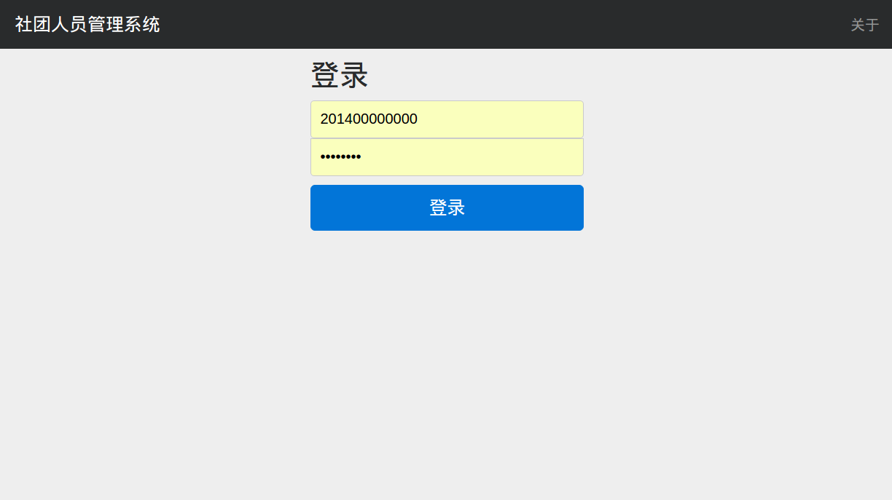
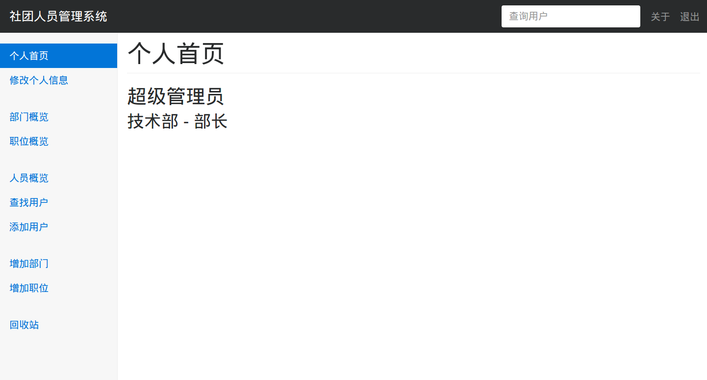
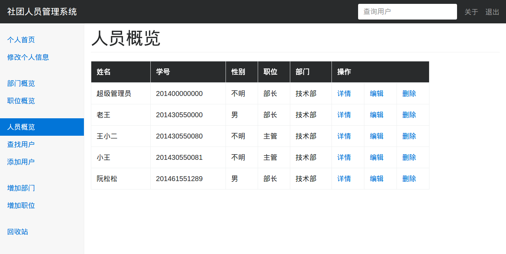
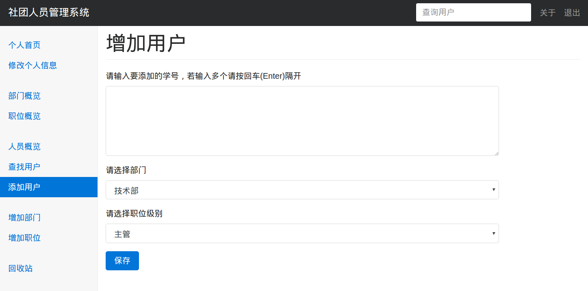

# 社团人员管理系统
## 概述
整个系统支持不同职位等级的人登录然后对人员进行管理，可以
满足大多数社团人员管理的需求
## 下载并安装node依赖包
```
git clone git@github.com:ruansongsong/PMS.git
cd PMS
npm install
```
## 配置
1. 创建数据库、数据表、插入超级管理员用户
```sql
-- 创建PMS数据库
create database PMS;
-- 创建用户的表
create table PMS.tb_users (
	u_no varchar(12) not null primary key,
	u_password varchar(16) not null default '12345678',
	u_name varchar(20) not null default '不明',
	u_sex varchar(2) not null default '不明',
	u_birthday date not null default '1960-1-1',
	u_school_college varchar(16) not null default '不明',
	u_college_department varchar(16) not null default '不明',
	u_department varchar(20) not null default '不明',
	u_position varchar(20) not null default '不明',
	u_tel varchar(11) not null default '不明',
	u_qq varchar(11) not null default '不明',
	u_place varchar(50) not null default '不明',
	u_intro varchar(200) not null default '不明',
	u_remark varchar(200) not null default '不明',
	u_permission int not null default 2,
	u_is_delete tinyint(1) not null default 0,
	unique(u_no)
) ENGINE=InnoDB  DEFAULT CHARSET=utf8;
-- 创建部门表
create table PMS.tb_departments (
	d_no int primary key not null auto_increment,
	d_name varchar(20) not null default '不明',
	d_intro varchar(500) not null default '不明',
	d_remark varchar(20) not null default '不明'
)ENGINE=InnoDB  DEFAULT CHARSET=utf8;
-- 创建职位表
create table PMS.tb_positions (
	p_no int primary key not null auto_increment,
	p_name varchar(20) not null,
	p_intro varchar(500) not null,
	p_remark varchar(20) not null
)ENGINE=InnoDB  DEFAULT CHARSET=utf8;
-- 插入超级管理员
INSERT INTO `PMS`.`tb_users`
(u_no, u_password, u_name, u_department, u_position, u_permission)
VALUES
('201400000000','songsong', '超级管理员', '技术部', '超级管理员', 0);
```
2. 在 ```PMS/conf/db-default.js``` 配置数据库
```javascript
// 连接数据库配置
module.exports = {
	mysql: {
		host: '127.0.0.1',
		user: '', // 数据库用户，一般是root
		password: '', // 数据库密码
		database: 'PMS', // 数据库名称
		port: 3306,
		dateStrings: true,
	}
}
```
## 启动应用
```
npm start
```
## 应用部分截图




